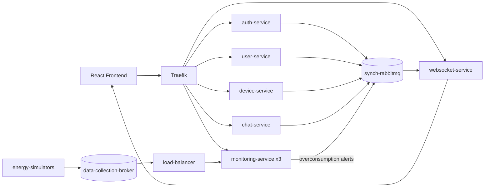

# Energy Management System

A distributed, event-driven platform for managing users and smart energy devices and monitoring their energy consumption in real time. It is built as Spring Boot microservices behind a Traefik gateway, deployed with Docker Swarm, and connected through RabbitMQ. A React frontend provides admin and user dashboards, overconsumption notifications, and a support chat with an AI fallback.

## Key Features

- **Authentication and roles:** JWT-based login with role-based access (admin and user dashboards).
- **User and device management:** CRUD for users and devices, and user-to-device assignment.
- **Real-time energy monitoring:** device simulators publish consumption readings that are processed by monitoring replicas.
- **Overconsumption alerts:** the monitoring service publishes alerts that the WebSocket service pushes to the frontend.
- **Scalable ingestion:** a custom load balancer distributes measurements across 3 monitoring replicas, with consistent hashing and round-robin strategies.
- **Support chat:** rule-based answers with a Google Gemini AI fallback, plus an admin chat panel.
- **Data consistency across services:** user and device events are synchronized between services via RabbitMQ.
- **API documentation:** Swagger UI exposed for the auth, user, device and chat services.

## Tech Stack

| Area | Technologies |
|------|--------------|
| Backend | Java, Spring Boot, Spring Security, Spring Data JPA, Maven |
| Frontend | React, Vite, Nginx |
| Messaging | RabbitMQ (two brokers: event sync and data collection), WebSocket |
| Data | PostgreSQL (one database per service) |
| Infrastructure | Docker, Docker Swarm, Traefik v2.10 |
| AI | Google Gemini API |
| Tooling | Python / Java energy simulators |

## Architecture Overview



- Each service owns its PostgreSQL database.
- Traefik routes by path prefix (`/api/auth`, `/api/people`, `/api/devices`, `/api/energy`, `/api/chat`, `/ws`) and serves the frontend on `/`.
- Measurements flow simulator -> data-collection broker -> load balancer -> monitoring replicas.
- Everything is defined in [main-stack.yml](main-stack.yml).

## My Role / What I Built


The repository covers the full stack: the backend microservices, the messaging and load-balancing layer, the Swarm deployment, and the React frontend.

## Challenges and Solutions

| Challenge | Solution |
|-----------|----------|
| Distributing measurements across monitoring replicas | Custom load balancer with consistent-hashing and round-robin strategies ([load-balancer](load-balancer/)) |
| Keeping data consistent across service-owned databases | Event publishing and consuming over RabbitMQ (user and device events) |
| Delivering alerts to the browser in real time | RabbitMQ consumer feeding a WebSocket service |
| Single entry point for many services | Traefik routing with path-based rules and shared middleware |

## Learning Outcomes

- Designing and deploying a microservice architecture with Docker Swarm and a reverse proxy.
- Event-driven communication with RabbitMQ and real-time delivery over WebSocket.
- Securing services with JWT and Spring Security.
- Implementing load-balancing strategies and horizontal scaling.
- Integrating an external AI API with a rule-based fallback.

## Getting Started

### Prerequisites

- Docker Desktop with Swarm mode
- Free ports: 80, 8080, 5672-5673, 15672-15673 and 5433-5438 (PostgreSQL)

### Steps

1. Set the Gemini API key (optional, used by the chat service):

   ```powershell
   $env:GEMINI_API_KEY = "<your-key>"
   ```

2. Initialize Swarm:

   ```powershell
   docker swarm init
   ```

3. Build the images (names must match [main-stack.yml](main-stack.yml)):

   ```powershell
   docker build -t auth-service ./auth-service
   docker build -t user_microservice ./user_microservice
   docker build -t device_microservice ./device_microservice
   docker build -t monitoring_microservice ./monitoring_microservice
   docker build -t chat-service ./chat-service
   docker build -t websocket ./websocket
   docker build -t load-balancer ./load-balancer
   docker build -t frontend ./frontend
   docker build -t energy-simulator ./energy-simulator
   ```

4. Deploy the stack:

   ```powershell
   docker stack deploy -c main-stack.yml sd
   ```

5. Check the services:

   ```powershell
   docker stack ps sd --filter "desired-state=running"
   ```

> Default credentials and keys in the compose and stack files are for local development only. Replace them for any real deployment.

## Example Usage

- Open `http://localhost` for the frontend and sign in as an admin or a user.
- As admin, create users and devices and assign devices to users.
- Energy simulators defined in the stack send readings every 30 seconds; the monitoring service stores them and raises overconsumption alerts shown in the notification center.
- Swagger UI: `http://localhost/user-swagger-ui`, `/device-swagger-ui`, `/auth-swagger-ui`, `/chat-swagger-ui`.
- Follow the monitoring logs:

  ```powershell
  docker service logs sd_monitoring-service --follow
  ```

## Repository Structure

```
.
├── auth-service/            # JWT authentication, roles
├── user_microservice/       # User management
├── device_microservice/     # Devices and user-device assignment
├── monitoring_microservice/ # Energy data processing and alerts (3 replicas)
├── chat-service/            # Rule-based + Gemini support chat
├── websocket/               # Real-time notifications
├── load-balancer/           # Consistent hashing / round-robin
├── energy-simulator/        # Device consumption simulator
├── frontend/                # React + Vite UI
├── gateway/                 # Traefik configuration
├── synch-rabbitmq/          # Event-sync broker config
├── data-collection-broker/  # Data-ingestion broker
└── main-stack.yml           # Docker Swarm deployment
```

## Future Improvements

- Move secrets (database passwords, JWT key) to Docker secrets.
- Add automated integration tests across services.
- Add centralized logging and metrics.
- Pin database image versions instead of `latest`.
